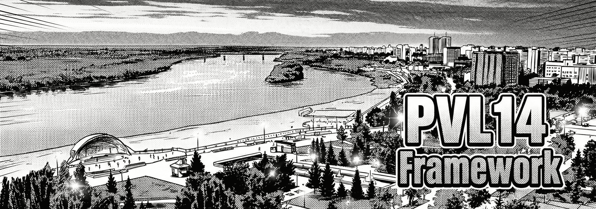

# PVL14

Lightweight open-source framework for masked discrete diffusion models

## Current codebase

Core classes exported by `pvl14/__init__.py`:

- `MDDM`
- `DiscreteUniformTD`
- `DiscreteAntitheticUniformTD`
- `DiscreteSymmetricUniformTD`
- `ContinuousUniformTD`
- `ContinuousAntitheticUniformTD`
- `DiscreteMaskedPrior`
- `LogLinearExpNoiseTransform`
- `LinearTimeSchedule`
- `CosineTimeSchedule`
- `ExponentialTimeSchedule`
- `run_inference_loop`

Additional schedules available from `pvl14/noise.py`:

- `CosineNoiseTransform`
- `LinearNoiseTransform`

## Project layout

- `pvl14/distributions.py`: time-step samplers (`DiscreteUniformTD`/`ContinuousUniformTD` variants) and masked prior (`DiscreteMaskedPrior`).
- `pvl14/noise.py`: continuous-time noise transforms (`t -> sigma -> alpha`).
- `pvl14/mddm/`: main model implementation (`MDDM`) split into train/infer mixins.
- `pvl14/inference.py`: reusable inference schedules + `run_inference_loop(...)`.
- `pvl14/utils.py`: shared tensor utilities used internally.

## Installation

```bash
pip install -e .
```

## Quick start (matches current APIs)

```python
import torch
from pvl14 import (
    MDDM,
    ContinuousUniformTD,
    DiscreteMaskedPrior,
    LogLinearExpNoiseTransform,
)

batch, seq_len, vocab = 2, 16, 100
mask_idx = vocab - 1

prior = DiscreteMaskedPrior(num_classes=vocab, mask_dim=mask_idx)
mddm = MDDM(
    time_distribution=ContinuousUniformTD(),
    prior_distribution=prior,
    noise_schedule=LogLinearExpNoiseTransform(),
)

# Start from a fully masked sample
xt = prior.sample(shape=(batch, seq_len))
logits = torch.randn(batch, seq_len, vocab)

xt_next = mddm.step_confidence(
    logits=logits,
    xt=xt,
    curr_step=0,
    num_steps=8,
    num_tokens_unmask=2,
)
```

## Forward noising and loss

```python
import torch
from pvl14 import MDDM, ContinuousUniformTD, DiscreteMaskedPrior, LogLinearExpNoiseTransform

batch, seq_len, vocab = 4, 12, 64
prior = DiscreteMaskedPrior(num_classes=vocab)
mddm = MDDM(
    time_distribution=ContinuousUniformTD(),
    prior_distribution=prior,
    noise_schedule=LogLinearExpNoiseTransform(),
)

x0 = torch.randint(0, vocab - 1, (batch, seq_len))
t = torch.rand(batch)  # continuous time in [0, 1]
xt = mddm.forward_process(x0, t)
logits = torch.randn(batch, seq_len, vocab)

loss_per_sample = mddm.loss(logits=logits, target=x0, xt=xt, time=t)
```

## Decoding options

- `decode_strategy="confidence"` (default): unmask top-confidence positions each step.
- `decode_strategy="self_path_planning"`: uses re-masking / regeneration behavior through `step_confidence(...)`.
- `decode_strategy="threshold_regen"`: re-masks low-confidence unmasked tokens and regenerates them in later steps.
  - Configure with `confidence_threshold`, `min_conf_gain`, `max_remask_frac`, and `allow_remask_unmasked`.

## Inference schedules + helper loop

```python
import torch
from pvl14 import (
    MDDM,
    DiscreteUniformTD,
    DiscreteMaskedPrior,
    LogLinearExpNoiseTransform,
    LinearTimeSchedule,
    CosineTimeSchedule,
    ExponentialTimeSchedule,
    run_inference_loop,
)

batch, seq_len, vocab = 2, 16, 100
prior = DiscreteMaskedPrior(num_classes=vocab)
mddm = MDDM(
    # Discrete time distributions are auto-normalized to [0, 1] during training.
    # For explicit continuous training-time sampling, use ContinuousUniformTD().
    time_distribution=DiscreteUniformTD(nsteps=16),
    prior_distribution=prior,
    noise_schedule=LogLinearExpNoiseTransform(),
)
x = prior.sample((batch, seq_len))

def model_fn(x, t):
    return torch.randn(x.shape[0], x.shape[1], vocab, device=x.device)

linear_sched = LinearTimeSchedule(nsteps=16, min_t=0.0, max_t=1.0)
cos_sched = CosineTimeSchedule(nsteps=16, min_t=0.0, max_t=1.0)
exp_sched = ExponentialTimeSchedule(nsteps=16, min_t=0.0, max_t=1.0, k=5.0)

x_linear = run_inference_loop(mddm, model_fn, x, linear_sched, strategy="step")
x_cos = run_inference_loop(mddm, model_fn, x, cos_sched, strategy="step")
x_exp = run_inference_loop(mddm, model_fn, x, exp_sched, strategy="step")
```

### Exponential schedule tuning

`ExponentialTimeSchedule(k=...)` controls how fast time decreases:

- Larger `k` (for example `k=7.0`): stronger early denoising, smaller late updates.
- Smaller `k` (for example `k=2.0`): closer to linear behavior.
- Constraint: `k > 0` and generated schedule must stay strictly decreasing.

## Threshold regeneration example

```python
import torch
from pvl14 import (
    MDDM,
    DiscreteUniformTD,
    DiscreteMaskedPrior,
    LogLinearExpNoiseTransform,
    ExponentialTimeSchedule,
    run_inference_loop,
)

batch, seq_len, vocab = 2, 16, 100
prior = DiscreteMaskedPrior(num_classes=vocab)
mddm = MDDM(
    time_distribution=DiscreteUniformTD(nsteps=24),
    prior_distribution=prior,
    noise_schedule=LogLinearExpNoiseTransform(),
    decode_strategy="threshold_regen",
    confidence_threshold=0.50,
    min_conf_gain=0.05,
    max_remask_frac=0.25,
    allow_remask_unmasked=True,
)

x = prior.sample((batch, seq_len))
schedule = ExponentialTimeSchedule(nsteps=24, k=5.0)

def model_fn(x, t):
    return torch.randn(x.shape[0], x.shape[1], vocab, device=x.device)

x_out = run_inference_loop(
    mddm,
    model_fn,
    x,
    schedule,
    strategy="confidence",
    confidence_threshold=0.50,
    min_conf_gain=0.05,
    max_remask_frac=0.25,
    allow_remask_unmasked=True,
)
```

## Notes

- Noise schedules (`LogLinearExpNoiseTransform`, `CosineNoiseTransform`, `LinearNoiseTransform`) expect time `t` in `[0, 1]`.
- `ContinuousUniformTD`/`ContinuousAntitheticUniformTD` sample continuous time in `(0, 1]`.
- `DiscreteUniformTD`/`DiscreteAntitheticUniformTD`/`DiscreteSymmetricUniformTD` sample discrete step indices in `[0, nsteps)`.
- `MDDM` auto-normalizes discrete time samples into `[0, 1]` for training-time noise schedules.
